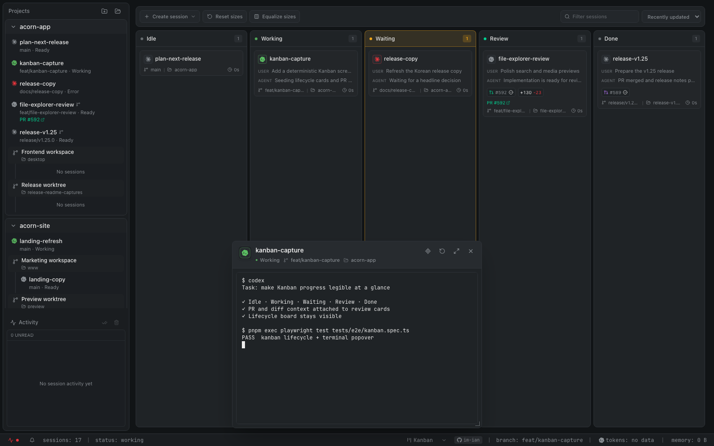
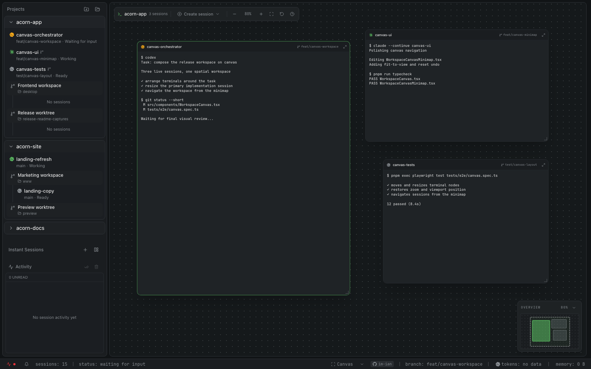

# Acorn Web

Acorn의 공식 제품 웹사이트입니다. 분할 Pane, Kanban, Canvas에서 여러 AI 코딩 에이전트 세션을 운영하는 Acorn의 주요 흐름을 한국어와 영어로 소개합니다.

- 웹사이트: <https://im-ian.github.io/acorn-web/>
- Acorn 앱: <https://github.com/im-ian/acorn>

## 제품 미리보기

### Kanban 워크스페이스

Idle부터 Done까지 세션 lifecycle을 한눈에 추적하고, 카드에서 diff·PR 맥락을 확인하거나 라이브 터미널을 바로 열 수 있습니다.



### Canvas 워크스페이스

라이브 터미널과 채팅 세션을 자유롭게 배치·크기 조절하고, 확대·축소와 미니맵으로 넓은 작업 공간을 탐색할 수 있습니다.



## 로컬 개발

```sh
pnpm install
pnpm dev
```

검증 명령:

```sh
pnpm check
pnpm build
```

주요 제품 문구와 스크린샷 연결은 `src/data/content.ts`, 전체 기능 카탈로그는 `src/components/FeaturesPage.astro`, 정적 이미지는 `public/screenshots/`에서 관리합니다.
